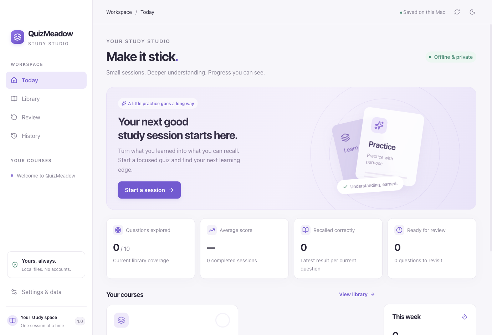
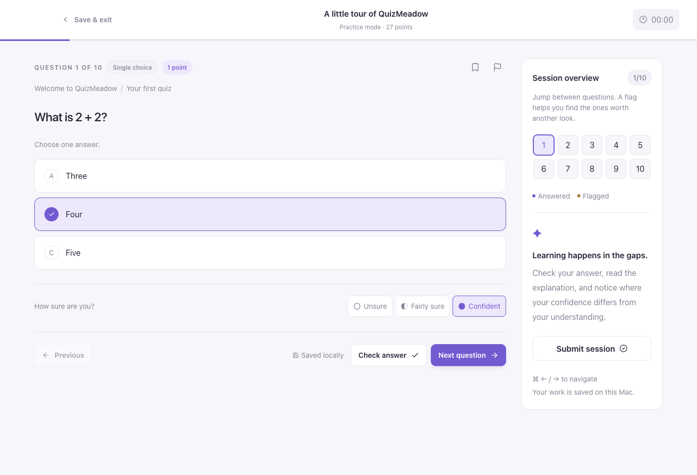

# QuizMeadow

**Grow what you know, one quiz at a time.**

QuizMeadow is a free, open-source desktop app for turning your study material into practice. Use it for languages, school subjects, professional courses, hobbies, or anything else you want to learn.

An AI assistant can prepare your quizzes. QuizMeadow runs them, explains the answers, and keeps your progress on your Mac. You can also write quizzes yourself.

**Offline · No account · No subscription · MIT license**

[Download for Mac](https://github.com/bilgon32/quizmeadow/releases/latest) · [Create your first quiz](#make-a-quiz-with-chatgpt-or-another-web-chat) · [Contribute](CONTRIBUTING.md)



## What you can do

- **Learn or test yourself.** Practice mode gives feedback as you go. Exam mode saves feedback until the end, with an optional timer.
- **Try ten question styles.** Single answer, multiple answers, true/false, ordering, matching, fill in the blanks, numbers, short answers, written responses, and code or structured text.
- **Choose how points work.** Each question has its own score. Several styles support partial credit. Written and code responses use a checklist so you can assess your own answer.
- **Organize a whole course.** Categories contain units, and units contain quizzes. Combine them into a mixed session when you want broader practice.
- **Keep improving.** Revisit mistakes, bookmark useful questions, record your confidence, and see which questions are due for review.
- **Pick up where you left off.** Your current session saves automatically. Completed attempts keep the questions, your answers, scores, and timing—even if a quiz changes later.
- **Keep your data.** Export results as JSON, CSV, or Markdown. All quizzes and results are ordinary files.
- **Make it comfortable.** Light and dark themes, readable text, keyboard navigation, gentle animations, and support for macOS Reduce Motion.



## Start here

1. Open QuizMeadow.
2. Take **A little tour of QuizMeadow**. It uses everyday examples to introduce the question styles. No programming knowledge is needed.
3. Create your first real quiz using [a web chat](#make-a-quiz-with-chatgpt-or-another-web-chat) or [a local agent](#use-codex-claude-code-cursor-copilot-or-gemini-cli).
4. Start a short practice session. Read the explanations, then return to the questions that need another look.

The starter library contains only the tour. You choose the subjects you want to study.

## Download for macOS

**[Download the latest release](https://github.com/bilgon32/quizmeadow/releases/latest)** — no Node.js, Terminal, or build tools needed.

| Your Mac | Download |
| --- | --- |
| Apple Silicon — M1, M2, M3, M4, or newer | [QuizMeadow for Apple Silicon](https://github.com/bilgon32/quizmeadow/releases/latest/download/QuizMeadow-mac-arm64.zip) |
| Intel (experimental) | [QuizMeadow for Intel](https://github.com/bilgon32/quizmeadow/releases/latest/download/QuizMeadow-mac-x64.zip) |

1. Download the ZIP for your Mac. If you are unsure, **Apple menu → About This Mac** shows whether it uses an Apple chip or Intel processor.
2. Unzip it and move **QuizMeadow.app** to **Applications**.
3. Open the app and try **A little tour of QuizMeadow**.

These early releases are **unsigned and unnotarized**, so macOS may restrict opening a downloaded copy. Release notes describe what was tested. The release page also includes checksums. See [Apple's guidance for apps from unidentified developers](https://support.apple.com/guide/mac-help/open-a-mac-app-from-an-unidentified-developer-mh40616/mac) if macOS asks you to review the app.

Building from source is optional and documented in [CONTRIBUTING.md](CONTRIBUTING.md). macOS is the primary platform; Windows and Linux installers are not provided.

## Your study library

Open **Settings & data → Study library → Open in Finder** to find your quiz files. You can choose a different root folder using **Choose another folder**.

A category is a subject or course. A unit is a chapter or topic. A quiz is one YAML file inside a unit:

```text
My Study Library/
  AUTHORING.md
  AGENTS.md
  world-geography/
    category.yaml
    capitals/
      unit.yaml
      first-capitals.yaml
```

**YAML** is a readable text format: a question has a title, point value, options, an answer, and an explanation. Agents can edit it without knowing how the app works. The library includes an [authoring guide](library/AUTHORING.md), a [tour with examples of every type](library/question-lab/01-formats/all-types.yaml), and JSON Schemas for editor validation.

Changes appear automatically. You can also click **Refresh library**. If a file has an error, the Library page shows its path and the problem; valid quizzes remain available.

## Make a quiz with ChatGPT or another web chat

You can do this with a free web chat. No API key, paid integration, or special plugin is required by QuizMeadow. Your provider's message and upload limits still apply.

1. Open the library folder in Finder. Open `AUTHORING.md`, then copy its text.
2. Start a new chat in [ChatGPT](https://chatgpt.com/), [Claude](https://claude.ai/), or [Gemini](https://gemini.google.com/). Paste the authoring guide, followed by your study notes. If uploads are available, you can attach the guide and notes instead. ChatGPT supports bringing documents into a conversation; pasting is the fallback when an upload is unavailable. [Official ChatGPT guide](https://learn.chatgpt.com/docs/use-chatgpt).
3. Paste this request, replacing the subject and topic:

```text
Create a QuizMeadow library about World geography, with a unit on
Capital cities. Follow the AUTHORING.md guide I provided.

Use my notes as the source. Create 8 original questions, mixing
single_choice, multiple_choice, true_false, short_answer, and written.
Give each question points and a helpful explanation. For written
questions, include a model answer and a rubric whose points add up.

Return three complete files, with each path above its own YAML block:
world-geography/category.yaml
world-geography/capitals/unit.yaml
world-geography/capitals/first-capitals.yaml

Keep answers accurate, explain uncertainty, and check the format.
Do not include chat commentary inside the files.
```

4. In your library folder, create `world-geography` and a `capitals` folder inside it. Save the three responses to the exact paths above. Download files if the chat provides them; otherwise use a plain-text editor. Copy only the YAML inside each block, without the triple backticks.
5. Return to QuizMeadow. Your quiz should appear in **Library**. If it reports an error, paste the message and the affected file back into the chat and ask for a corrected, complete file.
6. Read through the questions and answers before relying on the quiz, then begin a practice session.

On a Mac, TextEdit works: choose **Format → Make Plain Text** before saving. Make sure a file ends in `.yaml`, not `.yaml.txt` or `.rtf`. Choose the **whole library folder** in QuizMeadow, not just the `capitals` folder.

A web chat receives the notes you paste or upload. QuizMeadow itself keeps your study data locally.

See the [step-by-step walkthrough](docs/WEB-QUIZZES.md) for saving files, fixing errors, and improving an existing quiz. A [reusable prompt](library/WEB-AGENT-PROMPT.md) also travels with the starter library.

## Use Codex, Claude Code, Cursor, Copilot, or Gemini CLI

A local agent can write the files directly into your selected library. Open that folder as its workspace, provide your notes, and ask it to read `AGENTS.md` and `AUTHORING.md` before creating content.

| Agent | How to give it the library instructions |
| --- | --- |
| **Codex app / CLI** | Open the library as the project or working directory. It reads `AGENTS.md` there. [Codex instructions](https://developers.openai.com/codex/guides/agents-md/) |
| **Claude Code** | Ask it explicitly to read both files. For versions or configurations that expect `CLAUDE.md`, put `@AGENTS.md` in that file to import the shared instructions. [Claude instructions](https://code.claude.com/docs/en/memory) |
| **Cursor** | Open the library folder and use Agent mode. Cursor supports `AGENTS.md`; attach `AUTHORING.md` to the request. [Cursor rules](https://cursor.com/docs/rules) |
| **GitHub Copilot** | Open the library in your editor, use Agent mode, and attach both files. Copilot CLI also discovers `AGENTS.md`. [Copilot CLI instructions](https://docs.github.com/en/copilot/how-tos/copilot-cli/customize-copilot/add-custom-instructions) |
| **Gemini CLI** | Ask it to read both files. For recurring use, add a `GEMINI.md` telling it to read `AGENTS.md` and `AUTHORING.md` when authoring quizzes. [Gemini project context](https://geminicli.com/docs/cli/gemini-md/) |

Give the agent this request:

```text
Read AGENTS.md and AUTHORING.md in this library.
Using my notes, create a category for Spanish, a unit for greetings,
and a 10-question beginner quiz. Include points and explanations.
Write the YAML files into this library. Preserve existing content
and stable IDs when making revisions.

If the QuizMeadow source is available, run its library validator.
Otherwise, tell me to check the new files in the app and help repair
any reported errors. Do not edit my attempts or app data.
```

If the agent works in a different folder, give it the library's full path and access to write there. It needs access to the **library**, not your attempt history. These workflows use files; there is no built-in connection to an AI service. Installing an agent and any subscription it requires are separate from QuizMeadow.

## Your data and scoring

**Settings & data** shows the exact library and data paths and offers export buttons. Back up both folders. Completed attempts are separate JSON files with question snapshots, quiz revisions, answers, per-question points, confidence, flags, duration, timestamps, mode, app version, and timezone.

QuizMeadow uses automatic scoring for objective questions. Short answers match an authored list of acceptable responses; they do not use AI to judge meaning. Written and code responses are self-assessed against the author's checklist. Code is saved as text and never executed. Review scheduling uses a simple accuracy-and-confidence heuristic.

The app has no telemetry, sign-in, cloud sync, or required network connection. Opening a source link launches your browser only when you choose it. Exporting JSON saves a backup file; automatic backup import is not currently implemented.

## Contribute or build a release

QuizMeadow uses Electron, React, TypeScript, and YAML. Read [CONTRIBUTING.md](CONTRIBUTING.md) for development, checks, and packaging. Bug reports, accessibility improvements, documentation fixes, and subject-neutral examples are welcome.

QuizMeadow's source and original starter content are available under the [MIT license](LICENSE). Third-party dependencies keep their own licenses; see [third-party notices](THIRD_PARTY_NOTICES.md).
