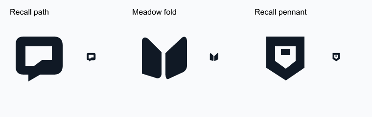
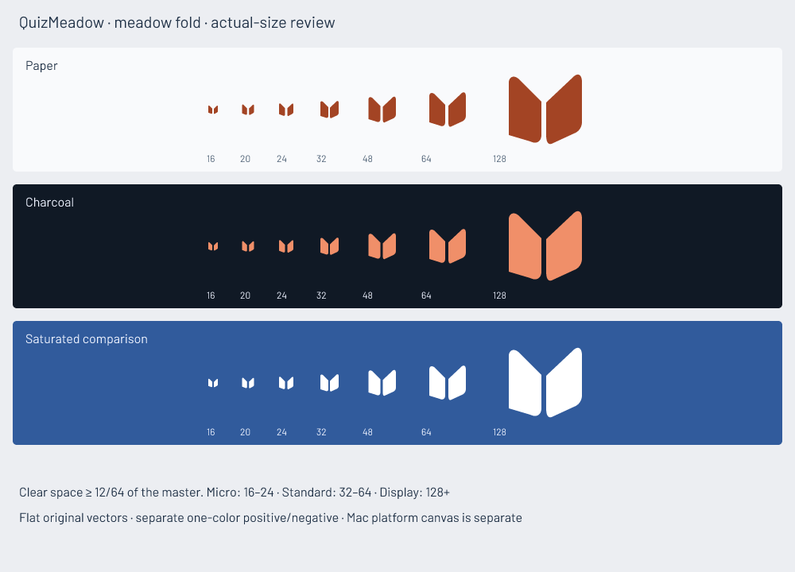

# QuizMeadow logo

QuizMeadow turns agent-authored study material into offline practice, scored attempts and useful review. The mark should suggest learning that unfolds with repeated use, and remain recognisable as a small desktop icon.

Three original black silhouettes were drawn and reviewed at 24px before color: **recall path** (an open return route), **meadow fold** (two upward blades/opening pages), and **recall pennant** (a clipped quiz marker). The meadow fold has the clearest negative-space valley and a distinctive asymmetric base. It connects the name's meadow to the act of opening and practicing, without a tiny checkmark diagram or an inherited ring.

## Optical masters and use

- `assets/logo/logo-source.svg` is the editable display construction; geometry uses a 64×64 grid.
- **Micro:** 16/20/24px. A wider eight-unit valley and stronger left mass retain separation at small sizes.
- **Standard:** 32/48/64px. Four-unit valley, softened tops and asymmetric bases; used beside the readable product name.
- **Display:** 128px and above. Separately corrected center/contours; used in large exports and the Mac icon.
- `logo-mono.svg`, positive and negative masters provide one-color forms. Size-specific `logo-*.svg` use `currentColor` for compositing; standalone theme exports contain explicit orange values.
- `quizmeadow-*-light.svg` uses #A34424 on paper; `*-dark.svg` uses #F08F69 on dark surfaces. The stable dark app header always uses the dark treatment.

Keep at least **12 grid units** of surrounding clear space (one quarter of the main mass height), excluding the master canvas itself. Do not stretch, add an outline/glow, crop the valley or put the mark back inside a ring. Use the micro master at 16–24px; do not shrink the display geometry. Keep the product name as live, licensed Barlow text; no unlicensed wordmark outlines are included.

Transparent PNGs are supplied at 16/20/24/32/48/64/128/256/512/1024px in both treatments and 1×/2× resolutions. The Mac package is separate: `resources/icon.svg`, its PNG iconset and `resources/icon.icns`. Its dark rounded platform canvas never becomes the freestanding product mark. Run `npm run icon` after installing dependencies to regenerate all local exports.

## Review and limits

The actual-size sheet was inspected on paper, charcoal and saturated blue, including monochrome, gap survival and optical center. The Mac 16/32/128px exports were inspected separately; the package contains 1024px artwork. The geometry is original and the fonts are licensed; the guide's fictional studies were not reused.

[Apple's current icon guidance](https://developer.apple.com/design/human-interface-guidelines/app-icons/) was checked. This Electron release uses its supported ICNS package; it does not claim a native layered Icon Composer variant or a Store review. No trademark clearance or exhaustive reverse-image search is claimed. VoiceOver, all display scalings and Intel hardware were not independently tested.
